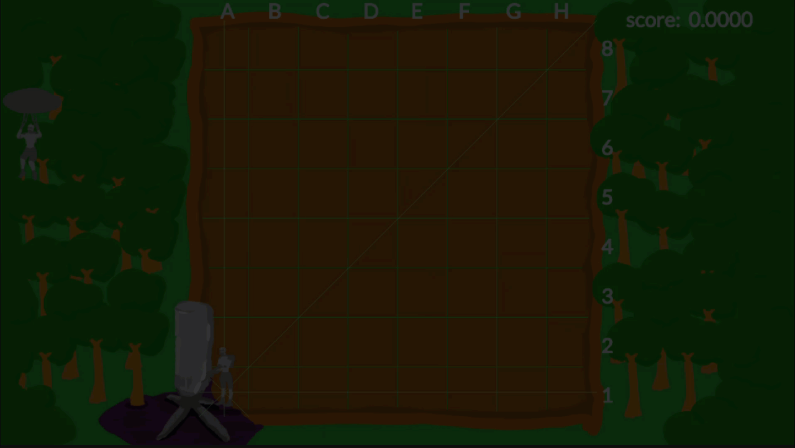
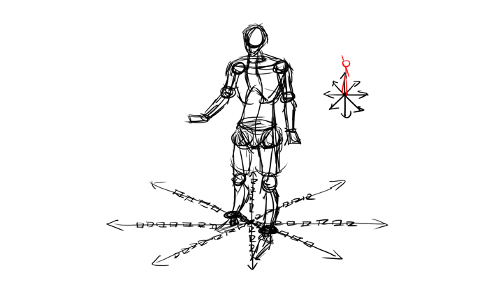
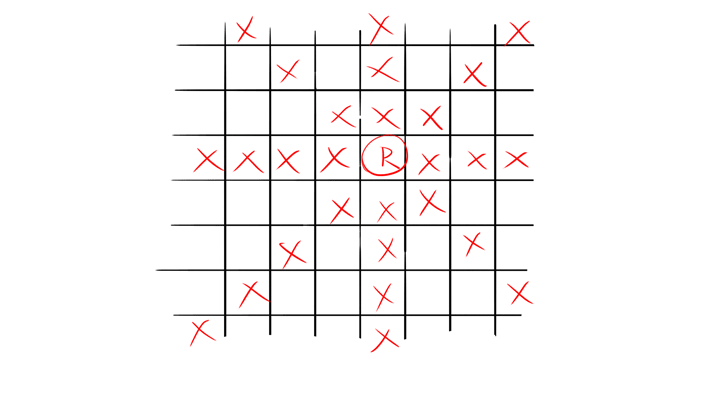
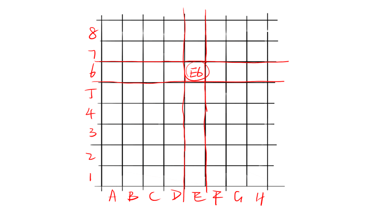
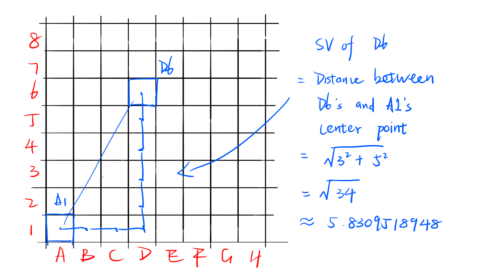

This project is a contribution for CodinGame, a variant of an eight-queens puzzle of a Solo game using the [Game Engine Toolkit](https://www.codingame.com/playgrounds/25775/codingame-sdk-documentation/introduction) of [CodinGame](https://www.codingame.com/).

This puzzle can be solved using the following concepts:Recursion, Backtracking, Permutations, Brute-force.Practice using these concepts and improve game player programming skills.

#Demo

#Game intro

## Goal
This is a variant of an eight-queens problem. But in this problem, you have pre-existing N riflemen (queens) and you should maximize the total distance from each rifleman to the lower-left corner. Out put the position of the remaining 8 - N riflemen.

## Rules
The challenge is to place eight riflemen (queens) on the board such that no riflemen are attacking any of the others, and you should maximize the total distance from each rifleman to the lower-left corner.

For those not familiar with chess pieces, the queen can attack every square on the same row, on the same column, and on either of the diagonals.

## Initialization input

`<<Line 1>>` An integer `N` for the number of riflemen who have arrived first. 
`<<Next N lines:>>` A string `S` for the coordinates of each rifleman.

## Input for a game round
none

## Output

`<<8 - N lines >>` The coordinates of the remaining riflemen. One coordinates string for a single line.

## Constraints

`0 <= N <= 7`

coordinates string `S` 
`'A' <=` the **first** character of `S` `<= 'H'` 
`1 <=` the **second** character of `S` `<= 8`

## STORY
In the land of PLZNERFR-301, people live by a natural-formed basin. They dug trenches, which happen to form an 8x8 grid, and planted crops on the land. Suddenly, on February 30th, a UFO (code NERFR-99) crashed into the lower-left corner of the basin and had weird liquid leaking out. To stop further pollution, the president decided to send riflemen to the location and blow up the UFO.

N riflemen had already arrived, but they discovered that they don’t have enough firepower to destroy the UFO. After 10 seconds of meticulous calculation, the riflemen find out they need at least 8 men.

Being afraid of ruining the existing crops, each rifleman used 4 strings (spreading out in the following 8 directions) to levitate himself. Each string was connecting the rifleman with the border of the basin.

It’s physically impossible to have two strings being collinear, and the strength of one string cannot withstand the weight of two riflemen. So, the commander should avoid putting the new rifleman if the new rifleman is in the way of an existing string.

(If a rifleman is in the spot ‘R’, you cannot place another rifleman in the ‘X’s)

Speaking of the commander, the commander is currently busy handling the RECOILCONTROLOFR-99 project, so it is your job to arrange the riflemen and save the people of PLZNERFR-301. The control panel uses a special coordinate system. The x-coordinates are expressed with ‘A’ to ‘H’, and the y-coordinates are expressed with numbers from 1 to 8 (A1 is the lower-left corner, where the UFO is).

Just now you received a report about the weird liquid, now having a name of MZBQHERE. The safe Value(SV) of a rifleman is equal to the distance between the rifleman and the UFO (each cell has a side length of 1 unit). You had a strange feeling that if you make the riflemen standing too close to the UFO, something horrible will happen.

Being affected by MZBQHERE, the N riflemen who arrived earlier refused to move.

*You have a strange feeling that if you make the riflemen standing too close to the UFO, something horrible will happen.

*You need to increase the total SV of all 8 riflemen.

Filling the board with 8 riflemen and having the highest total SVs possible, output the coordinate of the remaining 8 - N riflemen (using the special coordinate system). The inputs guarantee that there is always a satisfying answer. 
